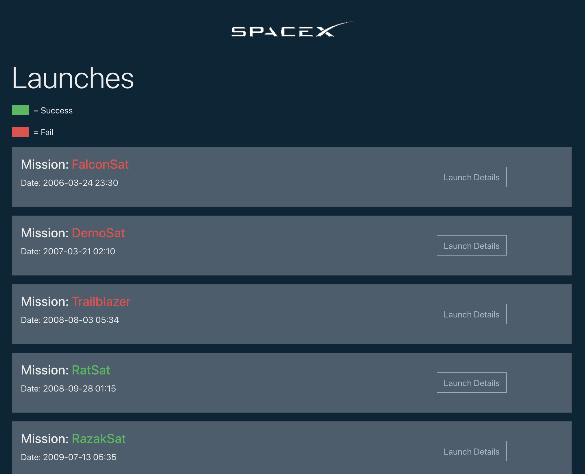
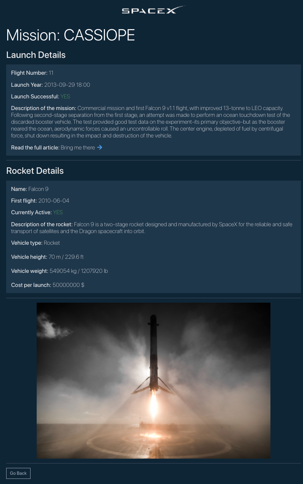

<h1># Project with SpaceX API using GraphQL and Apollo</h1>
https://radiant-sands-55345.herokuapp.com

<h2>Full-stack webapp that lists the launch missions of SpaceX</h2>

<h2>Introduction and Motivation </h2>
Motivated by the desire to acquire knowledge and experience on new tech tools, namely <strong>GraphQL</strong> and <strong>Apollo</strong>, I decided to work on this project.
Researching online, I have found the SpaceX API (<a target="_blank" href="https://github.com/r-spacex/SpaceX-API" >github repositiory</a>) which provide countless information about launch missions, vehicles and more. Suddenly, I realized it could have been the perfect resource for a project that applies a Query Language.
The webapp allows the visitors to search through all the SpaceX launch mission (about 155) from 2008 untill the latest one (the API is maintened and currently updated).
Additionally, the visitor can get more detailed information of a specific mission and the used Rocket by clicking on the selected launch mission.

<h2>Technologies</h2>
<h3>Frontend</h3>
For the frontend, the UI application is done exclusively by using Bootstrap and few inline styling with conditional rendering; the logic is done with JSX due to the use of the REACT framework. In order to manage the flow of data between the client and the back-end side, I used <a href="https://www.apollographql.com/docs/react">Apollo Client</a>.

<h3>Backend</h3>

For the backend, I used NODE.js powered with EXPRESS.js in combination with <a href="https://graphql.org/">GraphQL</a>. GraphQL allowed me to tweak the public APIs in order to ask for only the data I needed and nothing more.

<h3>Hosting</h3>
The application (Client and Server side) are hosted on <a href="https://www.heroku.com/home">HEROKU</a>.

<h2>Learnings</h2>

Developing and working on this project has been as extremely fun and educating. Completing this project, I have acquired experience and more familiarity with GraphQL, Apollo. Now, I feel much more confortable developping React app that query public APIs.
As always I work a new project, I get better at reading documentations and solve the problems that arised along the way.
